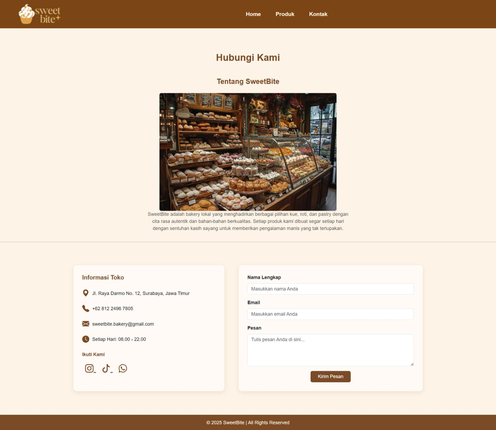

## Deskripsi Proyek
# SweetBite Bakery - Website E-Commerce 

SweetBite Bakery adalah proyek website yang dirancang untuk menjualbelikan toko roti dan kue. Proyek ini berfungsi sebagai katalog produk dan portal informasi utama bagi pelanggan, menampilkan konsistensi visual yang hangat dan profesional menggunakan palet warna cokelat dan krem.

Website ini dikembangkan menggunakan HTML, CSS, dan kerangka kerja Bootstrap untuk tata letak yang responsif. Fungsionalitas interaktif sederhana diimplementasikan dengan JavaScript murni.

## Fitur Utama
Proyek terdiri dari tiga halaman utama:

1.  Halaman Utama (index.html):
    * Hero Section dengan Carousel bergambar (banner).
    * Bagian Kategori Pilihan yang menampilkan Cake, Pastry, dan Bread dengan efek hover yang elegan.
    * Bagian singkat Tentang Kami dan Best Seller.

2.  Halaman Produk (produk.html):
    * Tampilan grid produk yang terorganisir per kategori.
    * Fitur navigasi cepat kategori dengan smooth scrolling.
    * Fungsionalitas Detail Produk interaktif menggunakan JavaScript murni untuk menampilkan informasi produk dalam modal box kustom.
    * Simulasi sederhana fitur Tambah ke Keranjang.

3.  Halaman Kontak (contact.html):
    * Informasi kontak toko (alamat, telepon, jam operasional) dan social media.
    * Formulir kontak fungsional dengan validasi dasar JavaScript.
    * Desain layout dua kolom yang informatif dan terstruktur.

## Teknologi yang digunakan
* HTML
* CSS 
* Bootstrap 5.3.2
* JavaScript

## Screenshot tampilan website
Tampilan Home

Tampilan Produk

Tampilan Kontak

## Informasi 
Nama (NIM): Revalina Natasya Sinaga (24051204123)
Mata Kuliah: Pemrograman Berbasis Platform (PBP)
Proyek: Website jual beli roti/bakery shop
Dosen Pengampu: Rifqi Abdillah, S.Tr.T., M.Kom.